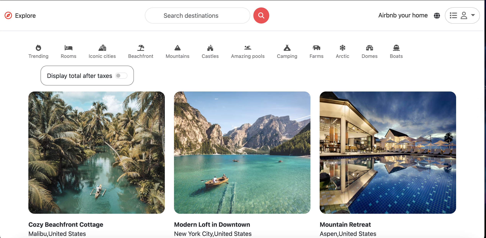
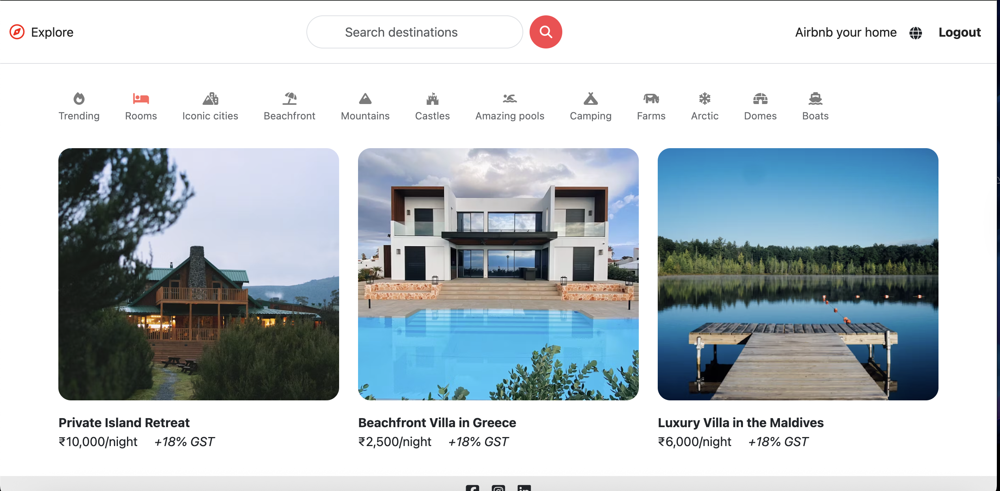

# Website link
 https://my-megaproject.onrender.com

# Screenshots



 # 🏡 My Airbnb Clone

A simple Airbnb Clone website built while learning backend web development using Node.js, Express.js, and MongoDB.
This project replicates some core functionalities of Airbnb, such as property listings, user authentication, and booking flow — all designed to strengthen backend and database skills.

# 🚀 Features

 - 🔐 User Authentication – Register and login using JWT-based authentication.

 - 🏠 Property Listings – Add, view, update, and delete property listings.

 - 📅 Booking System – Book available properties and view user bookings.

 - 💬 Reviews – Users can leave reviews and ratings for properties.

 - 🗺️ Dynamic Data Rendering – Data fetched from MongoDB and displayed dynamically.

 - ⚙️ RESTful API Structure – Clean and modular backend architecture.

# 🧠 Learning Goals

This project was created to:

   - Understand server-side development using Node.js and Express.js.

   - Learn how to structure routes, controllers, and models in a backend project.

   - Practice CRUD operations with MongoDB and Mongoose.

   - Explore API development, middleware, and authentication flow.

# 🏗️ Tech Stack

| Category            | Technologies Used                        |
| ------------------- | ---------------------------------------- |
| **Frontend**        | HTML, CSS, EJS (or React, if applicable) |
| **Backend**         | Node.js, Express.js                      |
| **Database**        | MongoDB with Mongoose                    |
| **Authentication**  | JWT (JSON Web Token), bcrypt.js          |
| **Version Control** | Git & GitHub                             |

# ⚙️ Installation and Setup

Clone the repository
```
git clone https://github.com/Ajay-Kumar-Prasad/MyMegaProject.git
```

Navigate to the project folder
```
cd MEGAPROJECT
```

Install dependencies
```
npm install
```

Setup environment variables
Create a .env file in the root directory and add:
```
PORT=8080
MONGO_URI=your_mongodb_connection_string
JWT_SECRET=your_secret_key
```

Run the development server
```
npm start
```

Open your browser and visit

http://localhost:5000

# 📂 Folder Structure
```
Airbnb-Clone/
│
├── assets/         # images
├── controllers/    # Business logic for each route
├── init/           # index.js, data.js
├── middlewares/    # middleware.js
├── models/         # MongoDB models (User, Listing, Review)
├── public/         # Static files (CSS, images, JS)
├── routes/         # Express routes for APIs
├── utils/          # ExpressError.js, wrapAsync.js
├── views/          # EJS templates
├── app.js          # Main server entry point
├── cloudConfig.js  # cloudinary
└── package.json
```

# 💡 Future Improvements

- Add payment integration (Stripe or Razorpay).

- Implement advanced search and filtering.

- Add image upload feature for property listings.

- Create an admin dashboard for managing users and listings.

- Deploy to cloud (Render, Vercel, or AWS).

# 🧑‍💻 Author

Ajay Kumar Prasad
🎓 B.Tech CSE @ NIT Andhra Pradesh
💻 Passionate about full-stack development, AI, and learning new technologies.
📫 GitHub
 | LinkedIn

# 📝 License

This project is licensed under the MIT License
